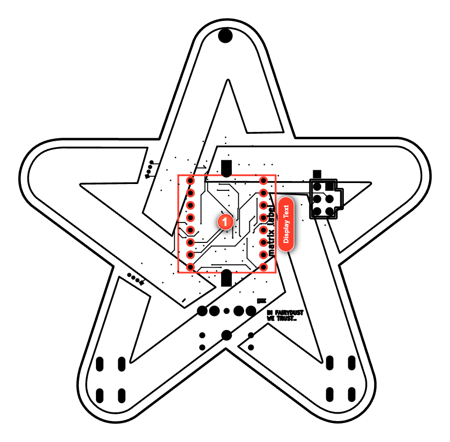
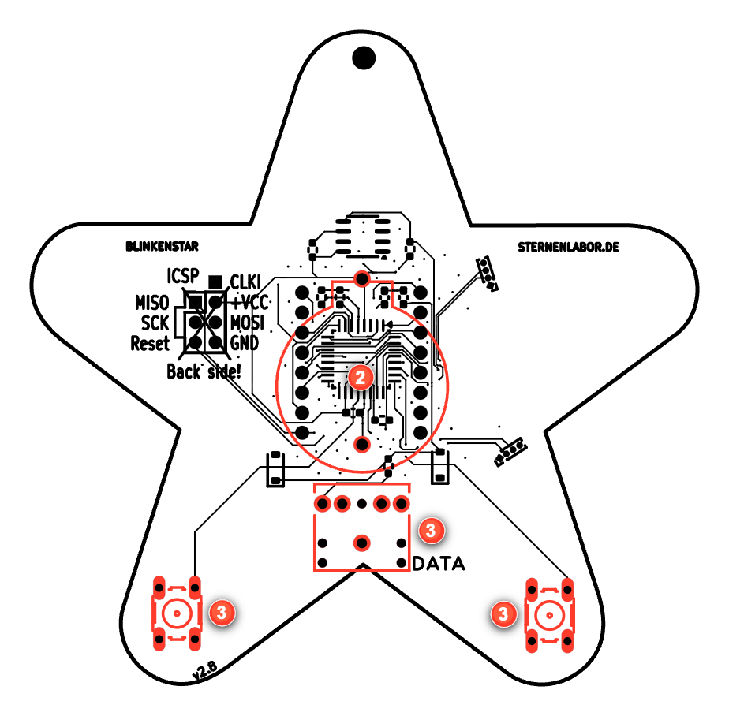
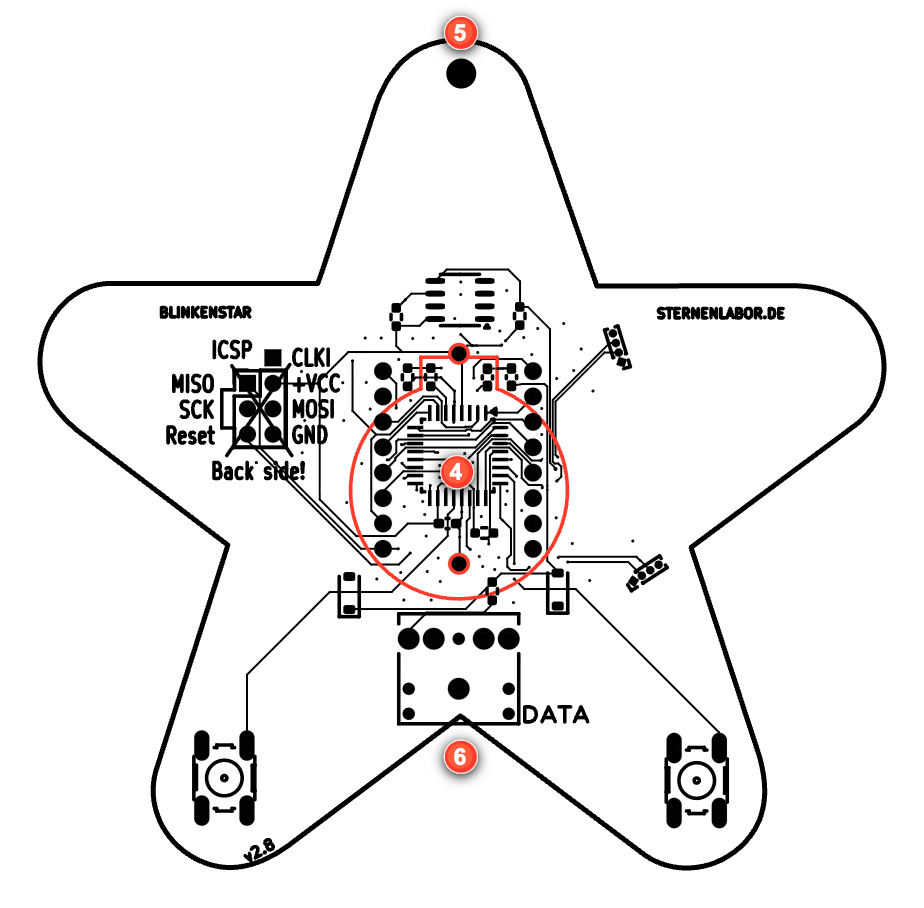

# Blinkenstar Manual - Montageversion

[page-1]: <> "page=1 width=306.14173 height=436.53543 background=#112749"

[text-001]: <> "x=84.206 y=308.397 width=137.73 font=Calibri-Bold size=24 color=#ffffff"

### BLINKENSTAR

[text-002]: <> "x=104.696 y=339.397 width=96.75 font=Calibri-Bold size=24 color=#ffffff"

### Anleitung

[page-2]: <> "page=2 width=306.14173 height=436.53543 background=#ffffff"

[text-001]: <> "x=31.181 y=43.192 width=132.218 font=Calibri-Bold size=14 color=#fe4219"

### SICHERHEITSHINWEISE

[text-003]: <> "x=36.85 y=68.935 width=251.325 font=Calibri size=9 color=#2e3037 line-height=13.799"

Nach dem Löten musst du dir deine Hände gründlich mit Seife
waschen. Lötzinn ist nicht gesund und sollte nicht in die Nähe von
Essen kommen. Essen und Trinken solltest du beim Löten vermeiden!

[text-002]: <> "x=31.181 y=203.189 width=86.812 font=Calibri-Bold size=14 color=#fe4219"

### LÖTEN LERNEN

[text-006]: <> "x=36.85 y=228.604 width=241.706 font=Calibri size=9 color=#33353b line-height=15"

Zum Löten benötigst du einen Lötkolben, der auf eine Temperatur
zwischen 310°C und 350°C eingestellt werden muss. Bei dieser
Temperatur wird das Lötzinn flüssig und verbindet dein Bauteil mit
der Platine. Bei so viel Hitze kannst du dich und andere schnell
verletzen. Stelle deswegen den Lötkolben immer in die Halterung,
wenn du ihn gerade nicht benötigst.

[page-3]: <> "page=3 width=306.14173 height=436.53543 background=#ffffff"

[text-001]: <> "x=14.173 y=43.354 width=175.412 font=Calibri-Bold size=14 color=#fe4219"

### BEDRAHTETE BAUTEILE LÖTEN

[text-002]: <> "x=19.843 y=68.739 width=252.025 font=Calibri size=9 color=#2e3037 line-height=15"

Stecke das Bauteil an der passenden Stelle durch die Löcher in der
Platine. Das Bauteil muss auf der bedruckten Seite aufliegen. Sollte
das Bauteil rausfallen, biege die Beinchen leicht zur Seite.
Nun lötest du nacheinander die Beinchen des Bauteils. Heize dazu
gleichzeitig das Beinchen des Bauteils und die Platine auf. Führe dann
seitlich etwas Lötzinn hinzu, bis sich ein kleiner Hügel Lötzinn bildet,
der das Loch vollständig bedeckt.

[text-009]: <> "x=19.843 y=262.589 width=241.468 font=Calibri size=9 color=#35373e"

Die Lötstelle sollte ungefähr wie auf dem folgenden Bild aussehen.
Überflüssiges Lötzinn kannst du mit der Lötspitze an dem Draht-
beinchen nach oben ziehen. Mit etwas Übung werden deine
Lötstellen immer besser!

[page-4]: <> "page=4 width=306.14173 height=436.53543 background=#ffffff"

[text-001]: <> "x=31.181 y=45.772 width=191.75 font=Calibri-Bold size=14 color=#fe4219 line-height=15"

### BLINKENSTAR RICHTIG LÖTEN:
DAS MATRIX DISPLAY

[text-003]: <> "x=35.63 y=86.693 width=9.108 font=Calibri-Bold size=18 color=#fe4219"

### 1

[text-009]: <> "x=53.858 y=95.344 width=229.473 font=Calibri size=9 color=#34363d"

Drehe die Platine auf die Seite mit dem weißen Stern.
Das nächste Bauteil ist das Matrix Display.
Stecke es auf dieser Seite durch die Löcher.
Verlötet wird es auf der Rückseite.
Versuche dabei die Beinchen nicht zu verbiegen.
Ganz wichtig: der Pin 1 des Displays
muss an der Pin 1 Markierung durch das Loch gesteckt werden!
Gibt es keine Pin 1 Markierung, achte darauf, dass der Text an der Seite des Displays nach rechts zeigt. Die einzelnen Pins lötest du
dann nach der Anleitung nacheinander an die Platine. Lasse
dabei die einzelnen Pins nicht zu warm werden.

[text-004]: <> "x=37.376 y=327.453 width=5.85 font=Calibri-Bold size=18 color=#fe4219"

### !

[text-005]: <> "x=53.858 y=334.454 width=217.732 font=Calibri size=9 color=#2d2f36 line-height=15"

Achtung! Achte unbedingt auf die "Pin 1" Markierung des
Displays! Gibt es keine Markierung, achte darauf, dass der
Aufdruck auf der rechten Seite ist. Das Display muss von der
Seite mit dem weißen Stern eingesetzt werden!

[page-5]: <> "page=5 width=306.14173 height=436.53543 background=#ffffff"

[page-6]: <> "page=6 width=306.14173 height=436.53543 background=#ffffff"

[text-001]: <> "x=31.181 y=44.772 width=191.75 font=Calibri-Bold size=14 color=#fe4219 line-height=15"

### BLINKENSTAR RICHTIG LÖTEN:
DIE BEDRAHTETEN BAUTEILE

[text-003]: <> "x=35.63 y=85.641 width=9.108 font=Calibri-Bold size=18 color=#fe4219"

### 2

[text-014]: <> "x=53.858 y=94.344 width=235.725 font=Calibri size=9 color=#32343b"

Stecke den Batteriehalter über den Mikrocontroller in die dafür
vorgesehenen Löcher. Verlöte die Beinchen auf der Seite mit dem
weißen Stern ganz knapp am Matrix Display.

[text-005]: <> "x=35.307 y=205.851 width=9.108 font=Calibri-Bold size=18 color=#fe4219"

### 3

[text-006]: <> "x=53.858 y=214.226 width=229.773 font=Calibri size=9 color=#2d2f36 line-height=15"

Nun lötest du noch die beiden Taster und die Audio-Buchse an.
Stecke die Pins von der Seite ohne weißen Stern durch die
Platine. Verlöte sie anschließend auf der Seite mit dem weißen
Stern. Sollten die Bauteile beim Löten herunterfallen, lege einfach
einen Gegenstand unter.

[text-004]: <> "x=37.376 y=323.618 width=5.85 font=Calibri-Bold size=18 color=#fe4219"

### !

[text-011]: <> "x=53.858 y=330.589 width=235.025 font=Calibri size=9 color=#33353b line-height=15"

Nur wenn die Lötstellen in Ordnung sind, wird dein
Blinkenstar richtig funktionieren. Prüfe daher nach dem Löten
aller Teile, ob diese fest mit der Platine verbunden sind.

[page-7]: <> "page=7 width=306.14173 height=436.53543 background=#ffffff"

[page-8]: <> "page=8 width=306.14173 height=436.53543 background=#ffffff"

[text-001]: <> "x=31.181 y=43.289 width=219.612 font=Calibri-Bold size=14 color=#fe4219"

### BLINKENSTAR IN BETRIEB NEHMEN

[text-002]: <> "x=35.957 y=66.79 width=9.108 font=Calibri-Bold size=18 color=#fe4219"

### 4

[text-012]: <> "x=53.858 y=75.305 width=233.906 font=Calibri size=9 color=#32343b"

Packe die Batterie aus und setze sie richtig in den Batteriehalter.
Ein kleines Plus zeigt dir, wie die Batterie in den Halter muss.
Dein Blinkenstar sollte jetzt schon etwas auf dem Display
anzeigen. Wenn nicht, dann prüfe, ob du alle Teile richtig gelötet hast und diese die richtige Richtung haben.

[text-017]: <> "x=35.732 y=169.844 width=9.108 font=Calibri-Bold size=18 color=#fe4219"

### 5

[text-018]: <> "x=53.858 y=178.241 width=230.919 font=Calibri size=9 color=#31333a"

Durch dieses Loch kannst du die Kordel fädeln, die deinem
Bausatz beiliegt. So kannst du deinen Blinkenstar um den Hals
hängen um ihn z.B. als Namensschild zu benutzen.

[text-021]: <> "x=35.732 y=246.756 width=9.108 font=Calibri-Bold size=18 color=#fe4219"

### 6

[text-003]: <> "x=53.858 y=256.843 width=235.23 font=Calibri size=9 color=#32343b line-height=15"

Mit dem beiliegenden Audio-Adapter kannst du deine
Blinkenstar mit neuen Texten und Animationen bespielen.
Stecke den Adapter in die Audio-Buchse an deinem Smartphone
oder Computer und stelle die Lautstärke auf das Maximum.
Gehe auf https://blinkenstar.sternenlabor.de/ und
folge den Anweisungen auf der Webseite. Sollte die Übertragung
nicht funktionieren, vergewissere dich, dass du die Lautstärke
auf das Maximum gestellt hast, alle Kabel verbunden sind und
keine andere Musik läuft.

[page-9]: <> "page=9 width=306.14173 height=436.53543 background=#ffffff"

[page-10]: <> "page=10 width=306.14173 height=436.53543 background=#ffffff reflow=true"

[text-001]: <> "x=31.181 y=43.509 width=180 font=Calibri-Bold size=14 color=#fe4219"

### ÜBER BLINKENSTAR

[text-002]: <> "x=36.85 y=65.698 width=205 font=Calibri size=9 color=#33353b line-height=15"

Deinen Blinkenstar kannst du jederzeit mit neuen Inhalten bespielen. Gehe dazu einfach mit deinem Smartphone oder Computer auf https://blinkenstar.sternenlabor.de/ und befolge die Anweisungen auf der Webseite. Den Programmcode sowie andere Dateien der Blinkenstar findest du frei zugänglich unter https://github.com/Sternenlabor/Blinkenstar.

Die erste Version des Blinkenstar Bausatz wurde in vielen Stunden von freiwilligen Helfern des Chaos Computer Club Düsseldorf e.V. und des shack e.V. mit viel Liebe zum Detail gebaut. Du kannst die beiden gemeinnützigen Vereine gerne mit einer kleinen Spende unterstützen! Die zweite Version der Blinkenstar wurde vom Metalab deutlich verbessert und kann beim Hackerspaceshop käuflich erworben werden. Mehr Details dazu finden sich unter http://hackerspaceshop.com.

Die Bilder der Lötanleitung sind aus dem Comic "Soldering is easy" von mightyohm.com entnommen und unter einer Creative Commons Attribution Share-Alike Lizenz lizensiert. Diese Anleitung und Blinkenstar Bilder sind ebenfalls unter dieser Lizenz lizensiert. Die Blinkenstar Platine ist unter der CERN Open-Hardware License Version 1.2 lizensiert, die Firmware steht unter der Lesser General Public License Version 3.0 (LGPL V. 3.0) zur Verfügung.

Dieser Bausatz wurde von Sebastian 'muzy' Muszytowski und Florian 'overflo' Bittner realisiert und mit freundlicher Unterstützung des Chaos Computer Club e.V. im Rahmen des "Chaos macht Schule" Projekt finanziell gefördert. Besonderer Dank gelten derf, marudor, rashfael, metachris und Chris Veigl sowie tele und linx.
