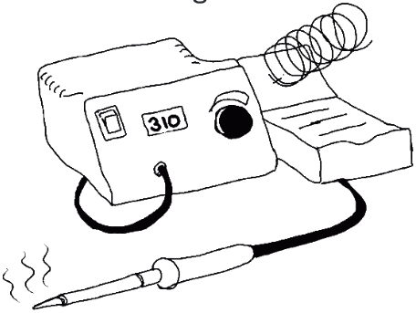
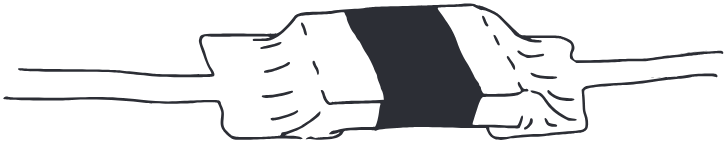
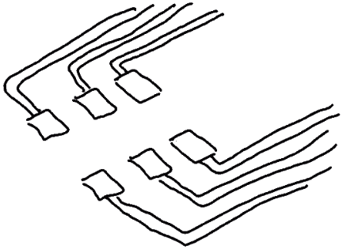
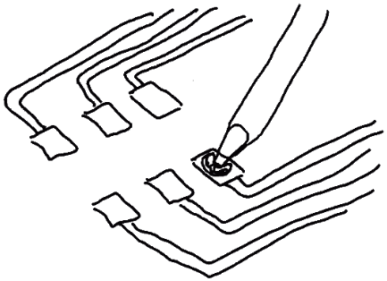
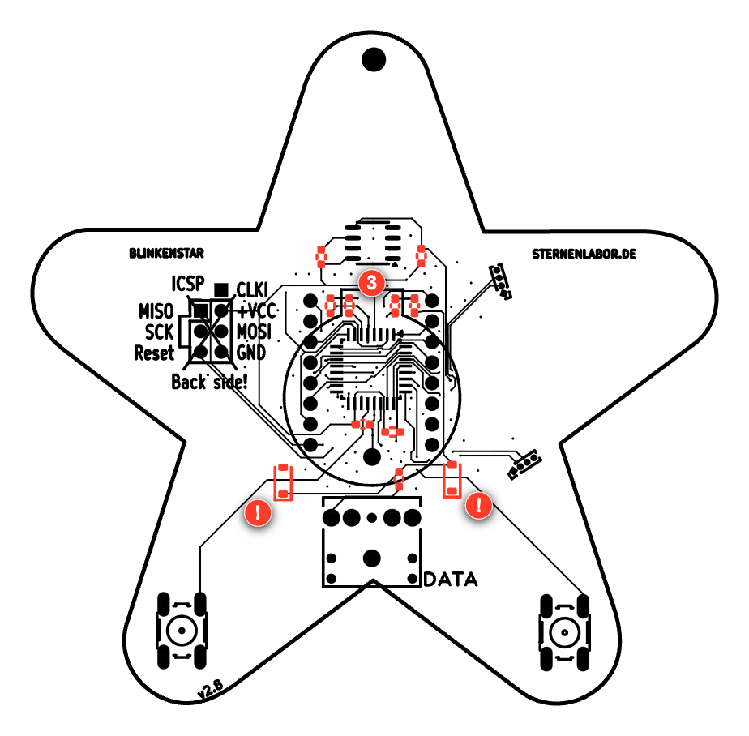
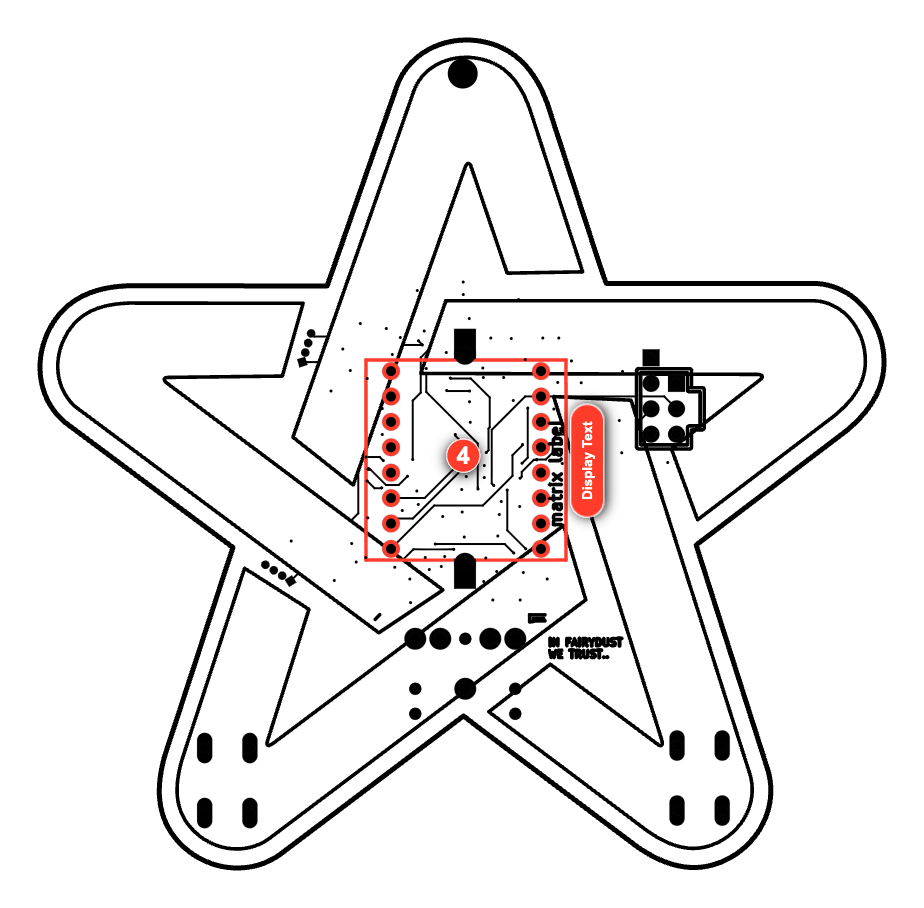
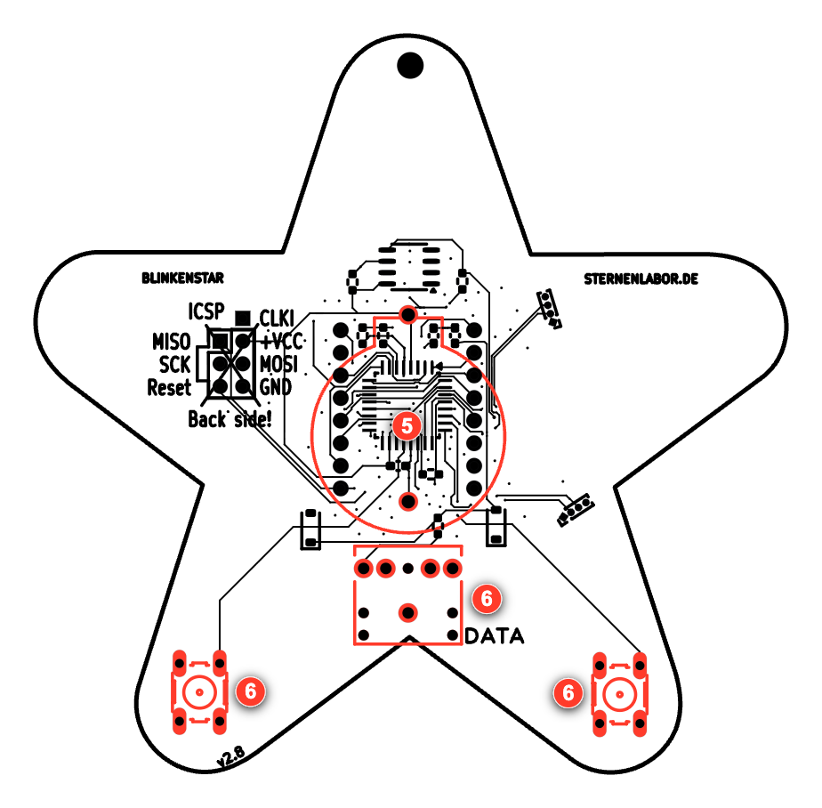
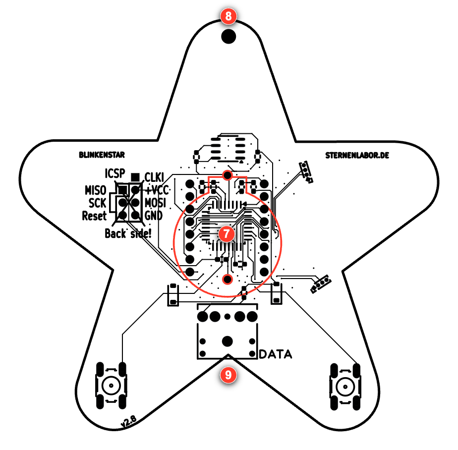

# Blinkenstar Manual

[page-1]: <> "page=1 width=306.14173 height=436.53543 background=#112749"

[text-001]: <> "x=84.206 y=308.397 width=137.73 font=Calibri-Bold size=24 color=#ffffff"

### BLINKENSTAR

[text-002]: <> "x=104.696 y=339.397 width=96.75 font=Calibri-Bold size=24 color=#ffffff"

### Anleitung

[page-2]: <> "page=2 width=306.14173 height=436.53543 background=#ffffff"

[text-001]: <> "x=31.181 y=43.192 width=132.218 font=Calibri-Bold size=14 color=#fe4219"

### SICHERHEITSHINWEISE

[text-003]: <> "x=36.85 y=68.935 width=251.325 font=Calibri size=9 color=#2e3037 line-height=13.799"

Nach dem Löten musst du dir deine Hände gründlich mit Seife
waschen. Lötzinn ist nicht gesund und sollte nicht in die Nähe von
Essen kommen. Essen und Trinken solltest du beim Löten vermeiden!

[text-002]: <> "x=31.181 y=203.189 width=86.812 font=Calibri-Bold size=14 color=#fe4219"

### LÖTEN LERNEN

[text-006]: <> "x=36.85 y=228.604 width=241.706 font=Calibri size=9 color=#33353b line-height=15"

Zum Löten benötigst du einen Lötkolben, der auf eine Temperatur
zwischen 310°C und 350°C eingestellt werden muss. Bei dieser
Temperatur wird das Lötzinn flüssig und verbindet dein Bauteil mit
der Platine. Bei so viel Hitze kannst du dich und andere schnell
verletzen. Stelle deswegen den Lötkolben immer in die Halterung,
wenn du ihn gerade nicht benötigst.

[page-3]: <> "page=3 width=306.14173 height=436.53543 background=#ffffff"

[text-001]: <> "x=14.173 y=43.354 width=175.412 font=Calibri-Bold size=14 color=#fe4219"

### BEDRAHTETE BAUTEILE LÖTEN

[text-002]: <> "x=19.843 y=68.739 width=252.025 font=Calibri size=9 color=#2e3037 line-height=15"

Stecke das Bauteil an der passenden Stelle durch die Löcher in der
Platine. Das Bauteil muss auf der bedruckten Seite aufliegen. Sollte
das Bauteil rausfallen, biege die Beinchen leicht zur Seite.
Nun lötest du nacheinander die Beinchen des Bauteils. Heize dazu
gleichzeitig das Beinchen des Bauteils und die Platine auf. Führe dann
seitlich etwas Lötzinn hinzu, bis sich ein kleiner Hügel Lötzinn bildet,
der das Loch vollständig bedeckt.

[text-009]: <> "x=19.843 y=262.589 width=241.468 font=Calibri size=9 color=#35373e"

Die Lötstelle sollte ungefähr wie auf dem folgenden Bild aussehen.
Überflüssiges Lötzinn kannst du mit der Lötspitze an dem Draht-
beinchen nach oben ziehen. Mit etwas Übung werden deine
Lötstellen immer besser!

[page-4]: <> "page=4 width=306.14173 height=436.53543 background=#ffffff"

[text-001]: <> "x=31.181 y=43.685 width=127.012 font=Calibri-Bold size=14 color=#fe4219"

### SMD BAUTEILE LÖTEN

[text-002]: <> "x=36.85 y=68.909 width=253.173 font=Calibri size=9 color=#2f3138 line-height=15"

SMD Bauteile sind Bauteile, die du auf der Oberfläche der Platine an
so genannte "Lötpads" anlötest. Lötpads sind Flächen auf der Platine,
die Lötzinn annehmen. Um ein SMD Bauteil anzulöten, erhitzt du die
Platine zunächst an den quadratischen oder rechteckigen Flächen, die
wir "Pad" nennen. Gib auf eine Seite eines Pad-Paares etwas Lötzinn
bis sich ein kleiner Berg Lötzinn gebildet hat. Es ist wichtig, dass
immer nur ein Pad mit Lötzinn bedeckt wird, sonst wird das Löten
sehr schwierig!

[text-010]: <> "x=36.85 y=249.743 width=247.219 font=Calibri size=9 color=#2e3037 line-height=15"

Halte nun den Lötkolben an das mit Lot bedeckte Pad und greife das
Bauteil gleichzeitig mit einer Pinzette. Schiebe das Bauteil mit einer
Seite in das flüssige Lot, so dass es mittig zwischen den beiden Pads
sitzt. Entferne nun den Lötkolben und halte das Bauteil solange fest,
bis das Lötzinn wieder fest geworden ist.

[page-5]: <> "page=5 width=306.14173 height=436.53543 background=#ffffff"

[text-001]: <> "x=19.843 y=68.909 width=253.668 font=Calibri size=9 color=#31333a line-height=15"

Um die andere Seite des Bauteils festzulöten, erhitzt du das Pad und
die noch fehlende Seite des Bauteils. Während du die Stelle mit dem
Lötkolben erhitzt, führst du solange etwas Lötzinn hinzu, bis die
Lötstelle wie auf dem Bild aussieht. Versuche das Bauteil zügig zu
löten, damit die gegenüberliegende Lötstelle nicht wieder warm wird.
Sehr hohe Temperaturen können das Bauteil beschädigen.

[text-007]: <> "x=19.843 y=250.247 width=233.968 font=Calibri size=9 color=#2e3037 line-height=15"

Deine Lötstellen sollten ungefähr so aussehen, wie auf dem Bild.
Die Pins der SMD Bauteile sollten seitlich komplett mit Lötzinn
benetzt sein. Wenn du die Platine nach dem Löten umdrehst,
dürfen die Bauteile nicht mehr abfallen.

[page-6]: <> "page=6 width=306.14173 height=436.53543 background=#ffffff"

[text-001]: <> "x=31.181 y=43.192 width=229.812 font=Calibri-Bold size=14 color=#fe4219 line-height=15"

### SMD BAUTEILE MIT VIELEN KONTAKTEN
EINFACH LÖTEN

[text-003]: <> "x=36.85 y=84.383 width=243.825 font=Calibri size=9 color=#31333a"

Es gibt SMD Bauteile mit sehr vielen Kontakten, die wir häufig auch
Beinchen oder Pin nennen. Daher haben die Bauteile an der dafür
vorgesehenen Stelle auf der Platine auch sehr viele Pads. Mit der
richtigen Technik ist das allerdings für dich sicher kein Problem!

[text-007]: <> "x=36.85 y=254.056 width=249.806 font=Calibri size=9 color=#31333a line-height=15"

Zuerst suchst du dir ein Pad an einer Ecke des Bauteils aus und führst
etwas Lötzinn hinzu, bis ein kleiner Berg entsteht. Das Prinzip kennst
du schon von den SMD Bauteilen mit nur zwei Kontakten.

[page-7]: <> "page=7 width=306.14173 height=436.53543 background=#ffffff"

[text-001]: <> "x=19.843 y=84.056 width=253.125 font=Calibri size=9 color=#33353b"

Anschliessend setzt du das Bauteil mit einer Pinzette auf die Pads und
richtest alle Beinchen so aus, dass sie auf den Pads aufliegen. Halte
das Bauteil mit der Pinzette die ganze Zeit gut fest, damit es nicht
wegrutschen kann. Jedes Bauteil hat eine Markierung, z.B. einen Punkt, oder eine Kerbe an der Seite, um dir die Ausrichtung zu
zeigen! Wenn du Bauteile verdreht auflötest funktionieren sie nicht!

[text-007]: <> "x=19.843 y=189.056 width=250.025 font=Calibri size=9 color=#31333a"

Nun erhitzt du den Pin mit dem Lötzinn, bis das Lötzinn geschmolzen
ist und den Pin umfließt. Nimm dann den Lötkolben weg und lasse
das Lötzinn wieder kalt werden. Wenn das Bauteil leicht verdreht ist,
erhitze den Pin wieder und drehe das Bauteil mit der Pinzette.

[text-011]: <> "x=19.843 y=264.056 width=253.325 font=Calibri size=9 color=#33353b"

Jetzt lötest du den diagonal gegenüberliegenden Pin an, indem du Pin
und Lötpad erhitzt und etwas Lötzinn hinzufügst. Mache dann mit
den noch nicht gelöteten Pins weiter.

[page-8]: <> "page=8 width=306.14173 height=436.53543 background=#ffffff"

[text-002]: <> "x=31.181 y=45.519 width=191.75 font=Calibri-Bold size=14 color=#fe4219 line-height=15"

### BLINKENSTAR RICHTIG LÖTEN:
DER MIKROCONTROLLER

[text-001]: <> "x=35.305 y=84.995 width=9.108 font=Calibri-Bold size=18 color=#fe4219"

### 1

[text-005]: <> "x=53.858 y=91.164 width=225.354 font=Calibri size=9 color=#2e3037 line-height=15"

Drehe die Platine so, dass sie dem Bild entspricht. Wenn der
Mikrocontroller schon verlötet ist, mache einfach mit Schritt 2
weiter. Ansonsten lötest du den Mikrocontroller U2 auf die
Platine. Diesen findest du in einer separaten Verpackung in
deinem Bausatz. Beim Löten folgst du am besten der
Lötanleitung für Bauteile mit vielen Kontakten.

Achte bitte besonders auf die Ausrichtung des Mikrocontrollers anhand der
kreisförmigen Markierung auf Platine und Bauteil!
Beginne zuerst mit einem einzigen Beinchen und richte den
Mikrocontroller richtig aus, so dass alle Beinchen auf ihrem Pad
sitzen. Löte dann das Beinchen gegenüber des bereits
angelöteten Beinchens an. So wird dein Blinkenstar sicher
funktionieren!

[text-004]: <> "x=35.776 y=293.141 width=9.108 font=Calibri-Bold size=18 color=#fe4219"

### 2

[text-019]: <> "x=53.858 y=299.511 width=236.906 font=Calibri size=9 color=#2e3037"

Das zweite Bauteil ist der EEPROM mit der Bezeichnung U3. Ist
dieser schon verlötet, mache einfach mit Schritt 3 weiter.
Auch dieses Bauteil lötest du wie das vorherige Bauteil zuerst mit
einem Beinchen an und richtest es dann aus. Achte auch hier wieder auf die kreisförmige Markierung die die richtige Richtung
vorgibt! Nachdem du den gegenüber liegenden Pin angelötet
hast, kannst du die anderen Pins festlöten.

[page-9]: <> "page=9 width=306.14173 height=436.53543 background=#ffffff"

[page-10]: <> "page=10 width=306.14173 height=436.53543 background=#ffffff reflow=true"

[text-001]: <> "x=31.181 y=45.519 width=191.75 font=Calibri-Bold size=14 color=#fe4219 line-height=15"

### BLINKENSTAR RICHTIG LÖTEN:
DIE KLEINEN BAUTEILE

[text-003]: <> "x=35.63 y=86.407 width=9.108 font=Calibri-Bold size=18 color=#fe4219"

### 3

[text-008]: <> "x=53.858 y=95.091 width=205 font=Calibri size=9 color=#33353b line-height=15"

Löte nun nacheinander die restlichen kleinen Bauteile
auf die Platine. Sind die Bauteile schon verlötet,
mache mit Schritt 4 weiter. Die Position der Bauteile
findest du auf der abgebildeten Platine.

[text-012]: <> "x=53.858 y=155.091 width=205 font=Calibri size=9 color=#33353b line-height=15"

Achte darauf, dass du die Bauteile an der richtigen
Stelle platzierst. Es ist wichtig, dass die SMD Bauteile
immer mittig zwischen den beiden Pads sitzen.
Wenn du die Platine wie abgebildet hinlegst,
sind alle Bauteile waagerecht angeordnet.

[text-004]: <> "x=37.376 y=352.712 width=5.85 font=Calibri-Bold size=18 color=#fe4219"

### !

[text-005]: <> "x=53.858 y=359.682 width=205 font=Calibri size=9 color=#33353b line-height=15"

Achtung! Die Dioden D1 und D2 müssen dieselbe
Richtung haben! Die Dioden haben dazu eine
Markierung auf ihrem Gehäuse, welche du auch auf
der Platine sehen kannst!

[page-11]: <> "page=11 width=306.14173 height=436.53543 background=#ffffff"

[page-12]: <> "page=12 width=306.14173 height=436.53543 background=#ffffff"

[text-001]: <> "x=31.181 y=45.772 width=191.75 font=Calibri-Bold size=14 color=#fe4219 line-height=15"

### BLINKENSTAR RICHTIG LÖTEN:
DAS MATRIX DISPLAY

[text-003]: <> "x=35.63 y=86.693 width=9.108 font=Calibri-Bold size=18 color=#fe4219"

### 4

[text-009]: <> "x=53.858 y=95.344 width=229.473 font=Calibri size=9 color=#34363d"

Drehe die Platine auf die Seite, auf der sich noch keine Bauteile
befinden. Die Beinchen bzw. Kontakte der Bauteile werden auf
der Seite festgelötet, auf der sich bereits die kleineren SMD
Bauteile befinden. Das nächste Bauteil ist das Matrix Display.
Stecke es auf der Seite mit dem weißen Stern durch die Löcher.
Verlötet wird es auf der anderen Seite, auf der sich die SMD
Bauteile befinden. Versuche dabei die Beinchen nicht zu verbiegen.
Ganz wichtig: der Pin 1 des Displays
muss an der Pin 1 Markierung durch das Loch gesteckt werden!
Gibt es keine Pin 1 Markierung, achte daruf, dass der Text an der Seite des Displays nach rechts zeigt. Die einzelnen Pins lötest du
dann nach der Anleitung nacheinander an die Platine. Lasse
dabei die einzelnen Pins nicht zu warm werden.

[text-004]: <> "x=37.376 y=327.453 width=5.85 font=Calibri-Bold size=18 color=#fe4219"

### !

[text-005]: <> "x=53.858 y=334.454 width=217.732 font=Calibri size=9 color=#2d2f36 line-height=15"

Achtung! Achte unbedingt auf die "Pin 1" Markierung des
Displays! Gibt es keine Markierung, achte darauf, dass der
Aufdruck auf der rechten Seite ist. Das Display muss von der
Seite eingesetzt werden, auf der noch keine Bauteile sind!

[page-13]: <> "page=13 width=306.14173 height=436.53543 background=#ffffff"

[page-14]: <> "page=14 width=306.14173 height=436.53543 background=#ffffff"

[text-001]: <> "x=31.181 y=44.772 width=191.75 font=Calibri-Bold size=14 color=#fe4219 line-height=15"

### BLINKENSTAR RICHTIG LÖTEN:
DIE BEDRAHTETEN BAUTEILE

[text-003]: <> "x=35.63 y=85.641 width=9.108 font=Calibri-Bold size=18 color=#fe4219"

### 5

[text-014]: <> "x=53.858 y=94.344 width=235.725 font=Calibri size=9 color=#32343b"

Stecke den Batteriehalter über den Mikrocontroller in die dafür
vorgesehenen Löcher. Verlöte die Beinchen auf der Seite mit dem
weißen Stern ganz knapp am Matrix Display.

[text-005]: <> "x=35.307 y=205.851 width=9.108 font=Calibri-Bold size=18 color=#fe4219"

### 6

[text-006]: <> "x=53.858 y=214.226 width=229.773 font=Calibri size=9 color=#2d2f36 line-height=15"

Nun lötest du noch die beiden Taster und die Audio-Buchse an.
Stecke die Pins von der Seite mit den SMD Bauteilen durch die
Platine. Verlöte sie anschließend auf der Seite mit dem weißen
Stern. Sollten die Bauteile beim Löten herunterfallen, lege einfach
einen Gegenstand unter.

[text-004]: <> "x=37.376 y=323.618 width=5.85 font=Calibri-Bold size=18 color=#fe4219"

### !

[text-011]: <> "x=53.858 y=330.589 width=235.025 font=Calibri size=9 color=#33353b line-height=15"

Nur wenn die Lötstellen in Ordnung sind, wird deine
Blinkenstar richtig funktionieren. Prüfe daher nach dem Löten
aller Teile, ob diese fest mit der Platine verbunden sind.

[page-15]: <> "page=15 width=306.14173 height=436.53543 background=#ffffff"

[page-16]: <> "page=16 width=306.14173 height=436.53543 background=#ffffff"

[text-001]: <> "x=31.181 y=43.289 width=219.612 font=Calibri-Bold size=14 color=#fe4219"

### BLINKENSTAR IN BETRIEB NEHMEN

[text-002]: <> "x=35.957 y=66.79 width=9.108 font=Calibri-Bold size=18 color=#fe4219"

### 7

[text-012]: <> "x=53.858 y=75.305 width=233.906 font=Calibri size=9 color=#32343b"

Packe die Batterie aus und setze sie richtig in den Batteriehalter.
Ein kleines Plus zeigt dir, wie die Batterie in den Halter muss.
Dein Blinkenstar sollte jetzt schon etwas auf dem Display
anzeigen. Wenn nicht, dann prüfe, ob du alle Teile richtig gelötet hast und diese die richtige Richtung haben.

[text-017]: <> "x=35.732 y=169.844 width=9.108 font=Calibri-Bold size=18 color=#fe4219"

### 8

[text-018]: <> "x=53.858 y=178.241 width=230.919 font=Calibri size=9 color=#31333a"

Durch dieses Loch kannst du die Kordel fädeln, die deinem
Bausatz beiliegt. So kannst du deinen Blinkenstar um den Hals
hängen um ihn z.B. als Namensschild zu benutzen.

[text-021]: <> "x=35.732 y=246.756 width=9.108 font=Calibri-Bold size=18 color=#fe4219"

### 9

[text-003]: <> "x=53.858 y=256.843 width=235.23 font=Calibri size=9 color=#32343b line-height=15"

Mit dem beiliegenden Audio-Adapter kannst du deine
Blinkenstar mit neuen Texten und Animationen bespielen.
Stecke den Adapter in die Audio-Buchse an deinem Smartphone
oder Computer und stelle die Lautstärke auf das Maximum.
Gehe auf https://blinkenstar.sternenlabor.de/ und
folge den Anweisungen auf der Webseite. Sollte die Übertragung
nicht funktionieren, vergewissere dich, dass du die Lautstärke
auf das Maximum gestellt hast, alle Kabel verbunden sind und
keine andere Musik läuft.

[page-17]: <> "page=17 width=306.14173 height=436.53543 background=#ffffff"

[page-18]: <> "page=18 width=306.14173 height=436.53543 background=#ffffff reflow=true"

[text-001]: <> "x=31.181 y=43.509 width=180 font=Calibri-Bold size=14 color=#fe4219"

### ÜBER BLINKENSTAR

[text-002]: <> "x=36.85 y=65.698 width=205 font=Calibri size=9 color=#33353b line-height=15"

Deinen Blinkenstar kannst du jederzeit mit neuen Inhalten bespielen. Gehe dazu einfach mit deinem Smartphone oder Computer auf https://blinkenstar.sternenlabor.de/ und befolge die Anweisungen auf der Webseite. Den Programmcode sowie andere Dateien der Blinkenstar findest du frei zugänglich unter https://github.com/Sternenlabor/Blinkenstar.

Die erste Version des Blinkenstar Bausatz wurde in vielen Stunden von freiwilligen Helfern des Chaos Computer Club Düsseldorf e.V. und des shack e.V. mit viel Liebe zum Detail gebaut. Du kannst die beiden gemeinnützigen Vereine gerne mit einer kleinen Spende unterstützen! Die zweite Version der Blinkenstar wurde vom Metalab deutlich verbessert und kann beim Hackerspaceshop käuflich erworben werden. Mehr Details dazu finden sich unter http://hackerspaceshop.com.

[text-020]: <> "x=36.85 y=317.43 width=205 font=Calibri size=6 color=#606267 line-height=8"

Die Bilder der Lötanleitung sind aus den Comics "Soldering is easy" von mightyohm.com und "SMT soldering - it's easier than you think" von siliconfarmers.com entnommen und unter einer Creative Commons Attribution Share-Alike Lizenz lizensiert. Diese Anleitung und Blinkenstar Bilder sind ebenfalls unter dieser Lizenz lizensiert. Die Blinkenstar Platine ist unter der CERN Open-Hardware License Version 1.2 lizensiert, die Firmware steht unter der Lesser General Public License Version 3.0 (LGPL V. 3.0) zur Verfügung.

Dieser Bausatz wurde von Sebastian 'muzy' Muszytowski und Florian 'overflo' Bittner realisiert und mit freundlicher Unterstützung des Chaos Computer Club e.V. im Rahmen des "Chaos macht Schule" Projekt finanziell gefördert. Besonderer Dank gelten derf, marudor, rashfael, metachris und Chris Veigl sowie tele und linx.
